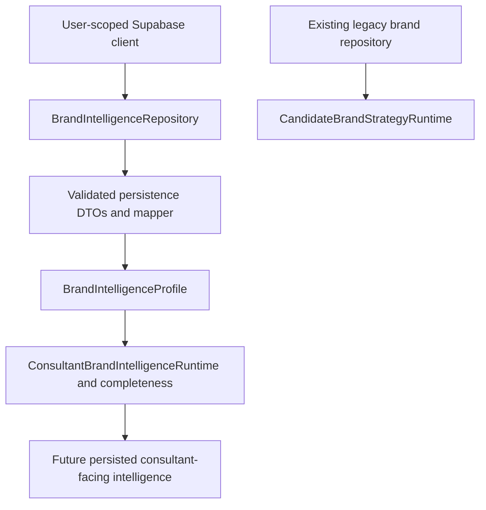

# Brand Intelligence persistence foundation

Local review checkpoint, September 8, 2026. Runtime composition remains unchanged.

## Starting checkpoint and boundaries

Branch `feature/fp002-interactive-runtime`; local HEAD, upstream tracking HEAD, and remote branch HEAD all matched `0df69ce0b0d704749125520f6d7b2058959a0b87`. Worktree was clean. `.env.local` was ignored and not tracked. The checkpoint contains the Brand Intelligence canonical model, consultant workspace, derived readiness, and evidence presentation (Packs 1/1B/1C). The preceding public unsubscribe utility and durable delivery worker commits remain intact.

Only local Docker/Postgres was started/reset. No hosted Supabase queries or writes, hosted seed, Preview changes, Vercel commands, Resend requests, DNS changes, AI calls, external brand research, deployment, commit, or push were performed. Hosted state was not independently audited; this confirmation describes the operations performed during this checkpoint.

## Existing conventions reviewed

Reviewed the identity/organization/membership migration and active-membership helpers; candidate and contact migrations and Supabase repositories; assessment/discovery immutable evidence patterns; privilege-hardening migration; campaign delivery lease migration and tests; existing pgTAP fixtures; and `persistence-development.md`. Existing repositories use server-only, user-scoped clients, generated database types, workspace authorization, and domain DTO mapping. Candidate/contact identity is tenant-owned; it is not a suitable ownership model for a shared franchise catalog.

The new migration follows UUID internal keys, opaque stable public identity, composite foreign keys, restrictive deletion, explicit grants, RLS, and empty function search paths. All new helpers are security invoker. The security approach also follows [Supabase's grants and RLS guidance](https://supabase.com/docs/guides/database/postgres/row-level-security).

## Schema map

| Table | Purpose and major keys | Ownership and read policy |
| --- | --- | --- |
| `brand_identities` | UUID PK; unique immutable `brand_...` public ID and normalized slug; name, lifecycle, shared/restricted visibility, timestamps | Global; active members see shared brands or brands with an active association to their organization |
| `brand_profile_versions` | UUID PK; unique `(brand_id, version_number)`; same-brand prior published basis; historical name, origin/actor, review/effective/publication timestamps; current-publication index | Global; only published versions of an accessible brand are readable |
| `brand_fact_definitions` | Exact canonical path PK; constrained value kind and enum choices; 50 initial definitions | Global governed registry; active members can read; only trusted DB administration adds definitions |
| `brand_profile_facts` | PK `(profile_id, fact_key)`; registry FK; one typed JSON value per fact with explicit knowledge/review/verification/confidence/approval/notes | Global profile content; readable through published profile RLS |
| `brand_evidence` | UUID PK; brand ownership; same-brand predecessor; source classification, title/date/URL/document/FDD/page/retrieval/review/verification/confidence/notes/actor | Global immutable snapshots; readable only when linked to an accessible published fact |
| `brand_fact_evidence` | PK `(profile_id, fact_key, evidence_id)`; same-brand composite FKs; position; at most one primary source per fact; reverse-source index | Global profile association; readable through published profile RLS |
| `brand_consultant_items` | UUID PK; unique `(profile_id, section, position)`; structured label/explanation; governed source paths; editorial/AI-assisted origin reference; actor/review/approval | Global editorial interpretation belonging to a profile version; readable through published profile RLS |
| `organization_brands` | PK `(organization_id, brand_id)`; active/inactive access/inventory association, timestamps; organization and brand FKs | Tenant relationship, platform provisioned; active members see their organization's rows |

All eight tables enable RLS, revoke PUBLIC/anon grants, and give authenticated users SELECT only. Tenant owners/admins are not platform editors. Service-role DML is explicit and still subject to lifecycle triggers; it cannot add fact definitions or TRUNCATE tables. No new public RPCs or security-definer functions exist. Only the membership policy helper is executable by authenticated users; the value validator is executable by the service role because content validation invokes it. Trigger functions have no direct application execution grants.

The association is deliberately an entitlement boundary, not a tenant self-service list. An organization cannot grant itself a restricted brand by submitting an organization ID. Notes, preferences, per-consultant availability, white-label display settings, and group inventories can later reference this identity without copying canonical brands. Association deactivation withdraws restricted access; shared visibility remains shared. Inactive brand lifecycle removes no history and does not itself revoke access.

## Profile lifecycle and concurrency

Profiles begin as `draft`. Draft facts, links, and editorial items can change. Approval to `reviewed` requires all registered fact rows (including explicit unknowns), reviewed facts/items, and verified evidence for any fact asserted as verified. Review records a trusted actor and date. Reviewed content freezes; returning to draft requires clearing review metadata before editing/reviewing again.

Only a reviewed profile can become `published`. Publication cannot alter reviewed metadata and stamps the actual publication time. Published profile metadata, facts, links, and editorial items are immutable. Effective date is descriptive provenance, not a scheduled-publication mechanism.

Current is exactly the highest published version number per brand:

```sql
select * from public.brand_profile_versions
where brand_id = :brand_id and status = 'published'
order by version_number desc limit 1;
```

Multiple historical published rows are intentional. `(brand_id, version_number)` uniqueness prevents ties. Publication locks the brand and rejects versions older than the current publication. Content mutations lock the parent profile, serializing edits against review/publication. A future writer should allocate version numbers transactionally and retry unique conflicts; no authoring RPC is introduced here.

Create a successor by inserting a new draft with a larger version number and `based_on_profile_id`, then copying fact values and evidence associations in a transaction. Reset review/verification as appropriate for the new review; copy editorial items with fresh review metadata. The basis must be a prior published profile of the same brand. Changing editorial interpretation alone likewise creates a new profile version. Independent editorial-release versioning can be added if later workflows need it.

Brand identity, slug, and public ID are stable. Display name can change on the catalog; each profile retains its own historical name. Use inactive lifecycle for archival. Profile deletion and all evidence update/delete operations are denied, including draft profiles/evidence, to preserve provenance. Retention or erroneous-draft cleanup requires a separately reviewed administrative policy.

## Governed facts and application mapping

The registry contains exactly the 50 `BrandFact` paths: five top-level descriptive facts; seven economics; thirteen characteristics; twelve fit attributes; six support; four system; and three top-level lists. The new unit test compares these paths against every current demo profile, excluding derived consultant intelligence.

Values use JSONB only at the individual fact boundary. Validation enforces strings, nonnegative numbers, booleans, controlled enums, typed arrays, USD money ranges with ordered nullable bounds, and recurring-fee objects with exact `name`/`amount` properties. Keys and value semantics cannot be caller-defined. New paths of existing value kinds need a reviewed registry INSERT by trusted DB administration, not table DDL or a rewrite of every data-access path. New value kinds require a validator change. Existing definitions cannot be changed or removed; introduce a new key if semantics change.

Category, industry, franchisor, website, and description live as versioned facts rather than competing identity-table copies. Stable UUID/public ID/slug live on the identity; `BrandIntelligenceProfile.name` should come from the selected profile's historical `brand_name`. `version.id`, effective date and approved-by map to the version row. Profile status maps draft to not-reviewed/in-review according to authoring state and reviewed/published to reviewed; the present UI does not model publication explicitly.

| Meaning | `knowledge_state` | `review_state` | `verification` | Value |
| --- | --- | --- | --- | --- |
| Unknown, not assessed | unknown | not-reviewed | unknown | SQL NULL, approval unavailable |
| Reviewed and explicitly unknown | unknown | reviewed | unknown | SQL NULL, approval unavailable |
| Known, not reviewed | known | not-reviewed | unverified/conflicting | Typed value, including false or zero |
| Known, reviewed but unverified | known | reviewed | unverified/reviewed/conflicting | Typed value |
| Verified | known | reviewed | verified | Typed value; verified evidence required for profile approval |

JSON null is not a substitute for a known value. Absence of a row in a working draft is incomplete authoring; it cannot pass review. A future adapter should turn missing newly introduced keys on older publications into an unknown/not-reviewed DTO without editing the historical publication. Existing `Suitability`/location enum `unknown` sentinels remain accepted for canonical type compatibility; authoring should use explicit unknown fact rows when no substantive value is known. Readiness and completeness retain current runtime semantics in this checkpoint.

## Evidence and consultant-intelligence boundary

An evidence row is a reusable immutable source snapshot, scoped to a brand. Multiple facts and profile versions can reference it. Reviewing, correcting, or retrieving a changed source creates a new snapshot with `supersedes_id`; old links keep pointing to the old snapshot. Source URL alone is not a unique key: the same document URL may change over time. Application ingestion should reuse an existing snapshot when its content/provenance is identical. Evidence association insertion enforces that profile, fact, and evidence belong to the same brand. Primary designation and ordering are separate from source classification.

Persist canonical description and factual fit expectations, including their inferred/unverified provenance. Derive business summary, franchisee-role signals, Strong Fit, Potential Friction, diligence gaps, glance items, completeness counts, and weighted Profile Readiness from the selected profile. These current deterministic strings and aggregate evidence arrays should not be stored as competing truths.

Optional future editorial content uses `brand_consultant_items`: bounded sections, ordered individual items, explanations, source-fact paths, origin/reference and review metadata. Source paths must point to facts in that profile and cannot be deleted/renamed out from under an item. Source evidence is traceable through those facts. Platform consultant notes use the `note` section; private tenant consultant notes require a future tenant-owned table. AI-assisted origin is representable but no provider is called. Candidate-specific match reasoning is entirely outside this schema.

## Six-brand review

All current data is demo material, not production verification. Nothing is seeded from these brands.

| Brand | Current demo inputs relevant to persistence | Runtime/unsupported boundary |
| --- | --- | --- |
| ERA Group | B2B consulting, USD 85k–175k investment / 75k liquidity, recurring revenue, executive/home-based model | Numeric ideal-candidate scores and boolean inputs derive fit levels/suitability; claims remain unverified |
| Schooley Mitchell | B2B consulting, 70k–140k / 60k, solo/home-based, relationship acquisition | Role/fit/friction prose is deterministic |
| ActionCOACH | Business coaching, 90k–220k / 75k, small-team/home or office model | Leadership/coaching summary and signals are deterministic |
| RouteWise Mobile Services | Curated concept, 65k–125k / 55k, mobile recurring residential routes | No website or verified franchisor; concept provenance must remain explicit |
| BrightPath Home Services | Curated concept, 190k–340k / 150k, team-led local service hub | Hub does not resolve to a known current operating-location enum; preserve uncertainty |
| Harbor & Hound Market | Curated concept, 425k–700k / 300k, physical retail, team-led, nonrecurring revenue | Known false recurring revenue must survive; staffing/location friction derives from facts |

Across all six, franchise fee, net worth, royalty, marketing fund, other fees, semi-absentee suitability, time commitment, prior experience, separate sales/field support, and system metrics remain unsupported/unknown. Franchisor identity is unknown. Existing websites are recorded only for the first three. The adapter duplicates category as industry and derives business type, customer model, operating locations, suitability, intensities, and fit levels from legacy inputs; these require provenance if later imported and are not independently sourced facts. Its financial-suitability sentence repeats investment thresholds and should be regenerated or editorially replaced, not blindly promoted as verified intelligence.

Do not persist `demoClassification` as a required production-domain field, legacy matching scores, `aiNotes`, referral contacts, demo tags/culture/success/poor-fit lists, or scoring order through this foundation. They are demo/matching or future relationship data outside the canonical governed-fact contract. Existing `BrandRepository` returns legacy `BrandProfile`; keep it for matching. A later intelligence-specific repository should return the canonical DTO without forcing production data into this legacy interface.

## Validation and files

Migration: `supabase/migrations/20260908140956_brand_intelligence_foundation.sql` (exactly one new migration; previous migrations unchanged).

New DB tests: `supabase/tests/database/020_brand_intelligence_foundation.test.sql`, using transactional fixtures and rollback, with 101 assertions. Full local suite: 20 files, 492 assertions passed after a clean local reset. No fixture brands persist after tests.

New application contract test: `tests/unit/brand-intelligence-persistence.test.mjs`. Focused Brand Intelligence, matching, campaign-worker, Resend provider and webhook regressions: 43 passed. Resend tests use mocked requests and do not call the provider.

`types/database.generated.ts` was regenerated from local Postgres; the diff adds only eight new table contracts (393 lines, after removing the generator's extra blank line at EOF). No runtime adapters or UI code changed. This document is the fifth changed/created file.

Local advisors reported no Brand Intelligence warnings or errors; the final security-only advisor run returned no issues. Six existing performance warnings concern `user_profiles` and `email_oauth_transactions` auth RLS initialization; those unrelated policies remain unchanged. TypeScript (`--noEmit --incremental false`), ESLint, production build (43 static pages), and `git diff --check` passed. No new ignored Supabase test artifacts were created; pre-existing stack metadata was preserved. Local and remote HEAD were rechecked and still match the starting checkpoint.

## Deferred work and next checkpoint

Review this schema before introducing a server-only intelligence repository, explicit validated row-to-DTO mapping, paginated current-profile listing, historical lookup, and authoring transactions with controlled actor identity. Generated CHECK-constrained text columns are typed as `string`; the adapter must validate/narrow values rather than cast opaque JSON. Production DTOs should separate demo classification and publish lifecycle, and distinguish unknown-review state without changing legacy matching.

Decide whether editorial releases eventually need a separate version sequence; currently all reviewed content is released together with its fact profile. Automated source deduplication, retention, publication scheduling, catalog search indexes, private tenant notes and white-label settings remain deferred. Test simultaneous publication and edit/review races through the future write API in addition to the database locking rules. No unresolved local validation issue is accepted as a substitute for these later runtime tests.

The next checkpoint should validate that repository/DTO layer with disposable local fixtures while retaining the existing demo UI source. Hosted application, migration, demo import and deployment require a later checkpoint.

## Checkpoint 2: canonical repository and matching separation

The canonical repository/mapping described below implements the local follow-up to Checkpoint 1. Its migration, pgTAP tests, generated DB types, and initial path test remain unchanged. No hosted migration, runtime UI switch, or matching switch is part of this checkpoint.

### Intentional matching boundary

`LegacyBrandProfileAdapter` is a **lossy compatibility projection**, from legacy `BrandProfile` to canonical `BrandIntelligenceProfile`. It converts numeric scores to coarse levels and drops values such as coachability and schedule flexibility. `CandidateBrandStrategyRuntime` consumes those exact numeric inputs, including leadership, sales intensity, operational intensity and relationship targets. Two different legacy profiles can therefore produce identical canonical intelligence while yielding different matching results.

Reverse reconstruction from canonical persistence to the legacy matching model is prohibited. Deterministic matching remains on `BrandRepository` / `SeedBrandRepository`. This is an intentional architectural separation. A separately authorized future Matching Input Contract must losslessly preserve every value consumed by matching, including numeric granularity and absent fields. No such contract, persistence tables or reverse adapter is implemented here.



### Read contract and composition

`BrandIntelligenceRepository` is separate from the legacy matching interface. `SupabaseBrandIntelligenceRepository` implements paginated catalog listing and current-profile reads by opaque stable public ID or slug. `createPersistedBrandIntelligenceRepository(client, workspace)` is a server-only, explicit opt-in factory. It neither creates a service-role client nor selects environments/fallbacks.

| Consumer | Source selected in this checkpoint |
| --- | --- |
| Existing Brand Intelligence UI | Existing `BrandIntelligenceRuntime` -> `SeedBrandRepository` -> forward legacy adapter |
| Local integration tests | Explicit authenticated client for loopback Supabase -> new factory/repository |
| Eventual hosted canonical intelligence | Same factory with server user-scoped client, after a separately authorized migration/runtime checkpoint |
| Candidate matching | Existing legacy repository and runtime, unchanged |

Pages, React components, workspace compositions, and the legacy runtime are untouched. React will receive canonical domain objects when wiring is separately authorized; raw rows stay inside the persistence boundary. There is no silent demo fallback on network, authorization, schema or decoding failure.

The repository verifies the selected workspace membership through the existing RPC and also constrains restricted catalog entries to that organization. This matters when a user belongs to multiple organizations: database RLS permits their memberships collectively, while the repository selects the requested workspace inventory. Shared brands remain global. Association changes never rewrite a brand. Integration tests exercise this distinction with two tenants and a multi-organization user.

### Mapping and failure behavior

`BrandFactRegistry.ts` defines the application validators, deterministic field paths and existing completeness labels together. Its key type and each validator's output type are checked against the corresponding domain fact. Before hydrating content, the repository compares the live SQL registry's keys, value kinds and enum choices with this registry. Unit tests additionally compare against all six canonical profiles and the unchanged Checkpoint 1 SQL path test. The two representations are checked rather than allowed to drift silently.

`BrandIntelligenceDTO.ts` validates row shapes and enums. `mapBrandIntelligence` validates individual values, cross-row identities, duplicates, associations, source review metadata and editorial references before constructing domain fields. It rejects numbers outside JavaScript's safe magnitude, nonfinite/negative amounts, malformed ranges/fee objects, string booleans, unknown paths and duplicate paths. Known false, zero, valid empty arrays, partial money bounds, explicit unknowns, review status, confidence and verification remain separate. Empty strings are not valid governed string facts under the existing SQL contract; free-form optional notes retain empty strings if present.

| Condition | Result |
| --- | --- |
| Inaccessible/nonexistent ID or slug | `null`; no demo fallback |
| Visible identity with no published version | Catalog entry with `profile: null`; direct profile lookup returns `null` |
| Higher draft/reviewed version | Ignored; highest published version remains current |
| Inactive brand | Omitted from default list; opt-in list and direct lookup retain historical publication |
| Missing fact or missing linked source | Deterministic data error, not an invented unknown/source |
| Malformed profile or registry drift | Deterministic data error |
| Membership/API failure | Repository error |

This deliberately tightens Checkpoint 1's prospective suggestion to synthesize missing newly introduced keys on old publications. Until an explicit backward-compatibility policy exists, incomplete profiles fail closed. Historical lookup is not exposed by this current-only interface; database history remains intact.

The canonical model gains optional persistence metadata on facts, evidence and profile versions plus version-bound editorial items. Persisted identity maps to `id` (`brand_...`) and `slug`; published historical name maps to `name`. The canonical demo-classification union adds `not-demo`: persisted profiles are never falsely labeled as curated or existing demos. Profile status is reviewed because consultant reads select published versions. Test publication review is explicitly fixture administration; it does not upgrade any source/fact verification.

Evidence snapshots retain all supported source fields, dates, document/FDD references, confidence, notes, predecessor and actor metadata. Per-fact associations carry independent position and primary designation; ordering is position then immutable source ID. No sources are invented. The root evidence collection is the union of all linked facts, improving on the legacy adapter's narrower completeness-field aggregation without changing any fact's provenance.

Editorial items retain origin/reference, review and approval metadata. Approved business-summary and role/fit/friction items can replace those derived sections. Unapproved copy never overrides them. Notes and editorial diligence items remain explicit separate governed items; they do not silently replace calculated gap states, since the current editorial schema has no gap-state field. Readiness, completeness, glance items and diligence-gap calculations remain deterministic. Summary verification is derived conservatively from its source facts.

### Query bounds and local validation

A normal individual read or six-brand list uses six API requests: membership verification, catalog with one published version embedded per identity, then four parallel batch readers for definitions, facts, evidence associations with embedded source snapshots, and editorial items. Listing uses a stable slug cursor and a page size of 1–100. Content reads use ordered pages of up to 500 rows and exact counts, so PostgREST row caps cannot silently truncate a profile. Each relation is bounded to 20,000 rows per catalog page and fails explicitly above that bound. No per-fact/per-source queries or caching are introduced. A 12-profile/600-fact integration fixture verifies seven requests, including the second facts page. The implementation uses Supabase's [select/count API](https://supabase.com/docs/reference/javascript/select).

The fixture builder converts the six existing canonical profiles into normalized test rows, preserving their claims and original source descriptions. Tests compare semantic fact values/provenance and all consultant-facing sections, excluding intentionally different database identities/audit dates and publication/demo classification. They do not reconstruct matching-only inputs. Integration setup uses local `psql` for tenant fixtures because the existing organization tables do not grant service-role INSERT; no grants are widened. Brand fixtures are then written through the explicit service role and read through authenticated API clients. The integration runner refuses non-loopback API URLs and never reads `.env.local`.

Run integration acceptance with a clean local stack and remove fixtures afterward:

```text
npx supabase db reset --local --no-seed
node --experimental-strip-types --test tests/integration/brand-intelligence-repository.test.mjs
npx supabase db reset --local --no-seed
npx supabase test db --local
```

The test-only TypeScript loader handles existing aliases/parameter properties and bypasses `server-only` only inside Node tests. Production modules retain the actual server-only import and normal Next.js enforcement. Matching tests freeze the unchanged committed-baseline rankings, scores, eligibility, rationale and numeric fit dimensions for John, Sarah, Jared and Elena; they do not replace expected results with reconstructed values.

Checkpoint 2 results: 49 focused unit/regression tests passed; eight integration tests passed; all 492 pgTAP assertions passed after fixture cleanup. TypeScript, ESLint, production build (43 static pages), `git diff --check`, and nine Chromium Brand Intelligence/Brand Strategy/portfolio E2E tests passed. The temporary API stack was stopped with volumes preserved, and only its new ignored `supabase/.temp` artifact was removed. That generated Edge Runtime file caused the first lint run to fail; lint passed after cleanup without weakening rules. Disposable database fixtures were removed by the final clean local reset before pgTAP.

Checkpoint 2 adds the three persistence modules (`BrandFactRegistry`, `BrandIntelligenceDTO`, `mapBrandIntelligence`), the canonical interface/repository/factory, two fixture helpers, two unit test files and one integration test file. It extends `BrandIntelligenceProfile.ts` with optional governance/provenance/editorial metadata and updates this report. Checkpoint 1 migration, DB tests, generated types and initial path test are preserved. No matching/runtime/UI implementation or hosted resources changed.

Next: review this read boundary, then authorize explicit canonical UI composition and production-domain presentation labels. Continue to keep matching isolated. Source ingestion, authoring, historical repository APIs, backward-compatible registry evolution and editorial gap-state presentation require separate decisions. Hosted migration, fixture import, commit/push and deployment remain outside this authorization.

## Checkpoint 3: canonical consultant UI with local persistence

The consultant library and profile routes now support the existing `PERSISTENCE_MODE=supabase` composition. This checkpoint validates that composition against the local Docker stack only. Hosted Preview migration, data loading, promotion and deployment remain a separate approval. The earlier checkpoint descriptions above record their original scope.

Both `/crm/brands` and `/crm/brands/[brandId]` resolve the normal workspace session. Production composition passes the authenticated server client and resolved organization/membership to `createPersistedBrandIntelligenceRepository`, then to `ConsultantBrandIntelligenceRuntime`. The runtime supplies canonical profiles to the existing library and profile components. Demo composition retains its existing source. No request-time service-role client, environment fallback, new tenant selector, or separate persistence-mode flag is introduced.

```text
Brand routes -> resolveWorkspaceComposition -> authenticated workspace
  -> production dependencies.brandIntelligence
  -> canonical repository -> validated mapping -> existing consultant UI
CandidateBrandStrategyRuntime -> SeedBrandRepository (unchanged)
```

Normal workspace resolution continues to handle no active membership, suspended membership and multiple active organizations; it does not guess an organization. The repository independently verifies membership and limits restricted inventory to the resolved workspace. Shared inventory stays global. Canonical persistence never reconstructs legacy matching inputs. John, Sarah, Jared and Elena retain the committed matching expectations, including exact rankings, scores, eligibility, rationale and numeric inputs.

### Deterministic local fixture workflow

`scripts/local-brand-intelligence.mjs` reuses `sixBrandFixtures()` from the existing repository-test fixture builder. That builder derives normalized rows from the existing six canonical demo definitions, avoiding a second maintained dataset: ERA Group, Schooley Mitchell, ActionCOACH, RouteWise Mobile Services, BrightPath Home Services, and Harbor & Hound Market.

The runner obtains local CLI status and rejects non-loopback API URLs before writing. It provisions a synthetic local consultant and organization, uses the service role only for local fixture administration, publishes each deterministic version through the existing lifecycle, and verifies all six through an authenticated application repository. A second load reuses published versions and repeats semantic comparisons. An incomplete publication fails explicitly and requires a disposable local reset; it is not silently repaired. Source claims remain unverified, unknowns remain explicit, and fixture review does not invent external evidence. Persisted fixture profiles display `Local demo profile`; ordinary persisted profiles display `Brand profile`.

The synthetic consultant receives a `Local Consultant` display name through the existing authenticated profile RPC only when its profile is absent. Repeated fixture loads do not create duplicate consultant profiles or repeat that profile-save event. This supplies normal workspace presentation without changing the shell.

```text
npx supabase db reset --local --no-seed
npx supabase test db --local
node --experimental-strip-types --test tests/integration/brand-intelligence-repository.test.mjs
npx supabase db reset --local --no-seed
node scripts/local-brand-intelligence.mjs
node scripts/local-brand-intelligence.mjs
node scripts/local-brand-intelligence.mjs e2e
```

Integration tests deliberately mutate disposable inventory, so reset before loading UI fixtures. Use `node scripts/local-brand-intelligence.mjs dev` to start the local persisted experience. The runner injects loopback Supabase configuration into the child process, leaves `.env.local` unchanged, and disables Resend credentials in that process. No hosted credentials are required.

### Missing records, failures and query bounds

Unknown/inaccessible public IDs and slugs, and identities without a publication, return the existing not-found behavior. Unpublished catalog entries are omitted from the rendered library. Repository, authorization and malformed-data errors fail closed with a generic Brand Intelligence error; the route boundary exposes no raw database details and uses this installed Next.js version's `unstable_retry` callback. It preserves the existing application error-panel styling. Tests temporarily revoke a local authenticated read grant, check both route boundaries, restore the grant in `finally`, and verify retry recovers persisted content.

Library search and filters operate over the accessible catalog. The runtime loads catalog batches of 100, follows stable slug cursors, and rejects repeated cursors. It does not call individual profile readers while listing. Repository content reads retain 500-row pagination and the existing 20,000-row relation bound per catalog page. Six profiles require six repository requests; twelve profiles crossing 500 facts require seven. A runtime test loads 150 profiles in two catalog calls with individual lookups prohibited. These counts exclude ordinary page authentication/workspace resolution. No caching was added.

Persisted E2E covers search/filter/card navigation, all six consultant summaries and completeness counts, slug/public-ID routes, inaccessible profiles, error recovery, browser errors, and desktop screenshots of the library, ERA Group and RouteWise. Fixture mapping tests compare fact/provenance semantics and every derived consultant section, preserving economics, operating characteristics, fit/friction, evidence and gaps.

### Recovery and local acceptance results (September 8, 2026)

Recovery resumed the exact seven modified/four untracked files reported after the crash at `018fffc4f96c3abdc09b843719ba6d5954de6ff7`. Surviving work was preserved; the fixture runner and E2E coverage were completed and this document updated. The foundation migration, generated types, canonical matching inputs and frozen matching expectations remain unchanged.

| Validation | Result |
| --- | --- |
| Clean local reset/apply | Passed twice; foundation migration applied both times |
| Full pgTAP suite | 20 files, 492 assertions passed |
| Repository integration | 8 tests passed, including tenant/multi-org isolation and query counts |
| Focused Brand Intelligence/composition/matching/portfolio units | 53 passed |
| Complete application unit suite | 224 passed, including the focused suite |
| Deterministic UI fixture | Repeated loads passed; exactly six shared brands, six published version-1 profiles, one consultant profile |
| Persisted Chromium E2E | 3 passed, including both route errors and successful retry |
| Brand Intelligence/Strategy/Presentation/portfolio and CRM routing E2E | 17 passed on unchanged full rerun |
| TypeScript | `npx tsc --noEmit --incremental false` passed |
| Optimized production bundles | Persisted and demo E2E builds passed; 43 static pages each |
| ESLint | `npm run lint` passed after generated artifact cleanup, without rule changes |
| Whitespace validation | `git diff --check` passed |

The first new error-boundary assertion matched Next.js's route announcer as well as the error panel; the selector now targets the panel. RouteWise screenshots now explicitly await completed navigation. One initial existing CRM routing test timed out navigating David Thompson; all 17 regression tests passed on an unchanged rerun. No matching expectations or CRM implementation were modified. Treat that isolated timing failure as an existing-test stability observation, not evidence that matching changed.

Focused visual inspection covered the library, persisted ERA Group and persisted RouteWise at 1440 and 1280 pixels. Brand content, readiness, summary and fit/friction presentation remained consistent, with no horizontal page overflow. The existing shared header still wraps at 1280 pixels; shell layout work remains outside this checkpoint. Screenshots and the initial CRM failure trace were copied to a temporary evidence directory outside the worktree before generated test output cleanup.

Happy-path persisted browsing reported no console/page errors or hydration failures. The deliberate permission-failure test produced only the expected generic server errors; both routes failed closed and recovered after the local grant was restored. Final local inspection confirmed the authenticated definition-read grant restored and all six fixtures still published. No ordinary Brand Intelligence request uses the service role, and no persistence failure falls back to demo data.

The local stack was stopped using the normal CLI workflow with volumes preserved. Only the inspected ignored Edge Runtime `supabase/.temp/start-secrets` directory and generated `test-results` output were removed; pre-existing metadata, `.env.local`, and build caches were preserved. `.env.local` remains ignored and untracked. No Docker/cloud configuration, hosted database, Preview, Production, Vercel, Resend or DNS was changed. No commit, push or deployment was performed. Hosted promotion and the future Matching Input Contract remain separately authorized work.
